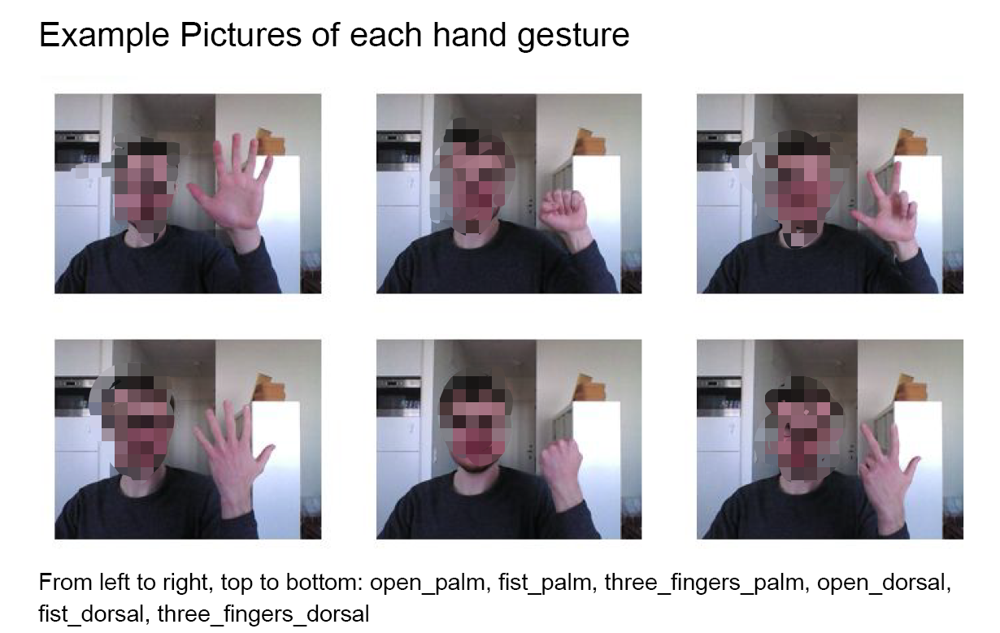

# End2end model for hand gesture recognition

## Introduction
This project aims to recognize 6 pre-defined gestures from videos.
As following images showing, there are 'fist_dorsal', 'fist_palm', 'open_dorsal', 'open_palm', 'three_fingers_dorsal', 'three_fingers_palm'.


## Quick start
1. Install Opencv

    You should install Opencv in your environment.

2. git clone this project 

    ``` Python 
    git clone https://github.com/nanguoyu/End2end-model-for-hand-gesture-recognition.git
    cd End2end-model-for-hand-gesture-recognition
    pip install -r requirements.txt
    ```

3. Download data set
    
    ```
    python DownloadData.py
    ```

3. Train an end-to-end model for hand gesture recognition:
    
    ```
    python train_End2end.py
    ```

4. Train a model for handmarks extraction:

    ```
    python train_SubSystem1.py
    ```

5. Test the end2end model:

    ```
    python test_end2end.py
    ```
   
6. Test the model for handmarks extraction:

    ```
    python test_subsystem1.py
    ```
      
## Other
This is the sub project of 
[Intelligent-Interactive-Systems-Project](https://github.com/nanguoyu/Intelligent-Interactive-Systems-Project)

#### Demo for the end2end detection model
[](https://www.youtube.com/watch?v=I9NC9vfVFQM)
